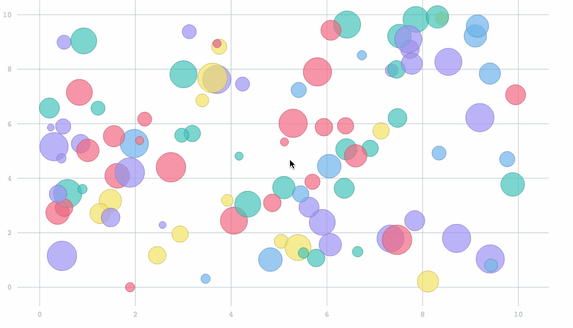

d3-multiaxis-zoom
=================

d3 plugin to zoom along multiple axes independently




## Usage

Script Tag:
```

<script src="http://d3js.org/d3.v3.min.js"></script>
<script src="../path/to/d3-multiaxis-zoom.js"></script>
<script type="text/javascript">
	
	// Apply to plugin
	d3_multiaxis_zoom(d3);

	// now all d3.behavior.zoom instances will be modified with this plugin

</script>

```

Browserify:
```js
var d3 = require('d3');
require('d3-multiaxis-zoom')(d3); // apply the plugin

```

## License

MIT
